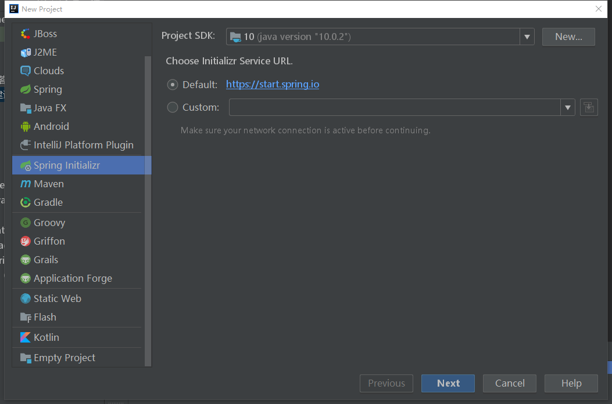
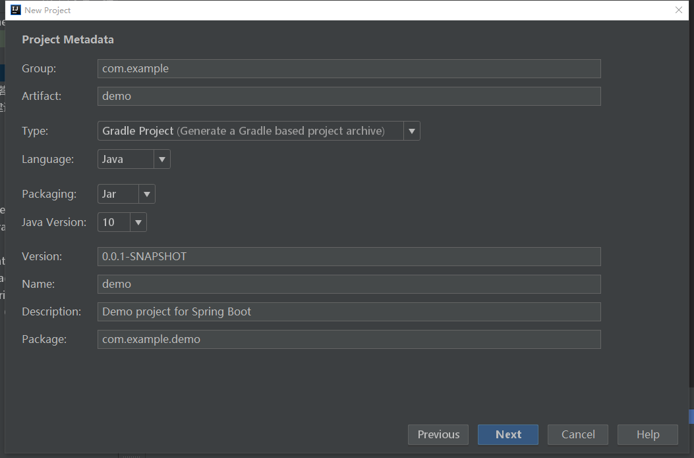
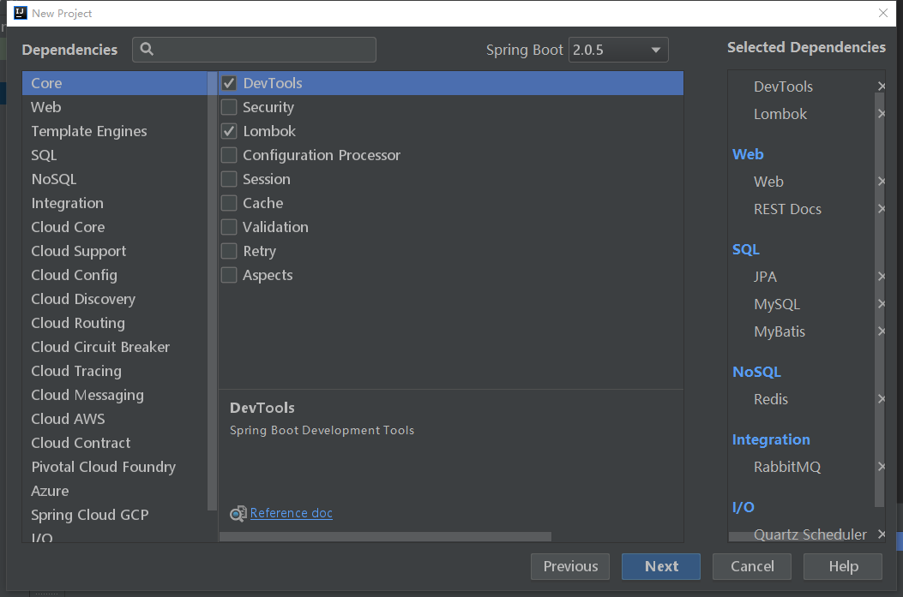
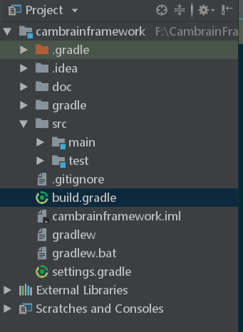

# SpringBoot框架搭建学习

### 第一章 创建项目

  
    第一步: 通过SpringBoot 创建项目  
    
  1 . 项目简要说明：
  
  >  - jdk版本: jdk-10
  >  - 项目构建方式：Gradle
  >  - Spring Boot 版本： 2.0.5.RELEASE
  
   

   如下图所示：
   
   
   2 . 选择项目构建方式
   
   如下图2所示：
   
   
   3 . 选择项目依赖
   
   根据可能会用到的功能选择了一下相关依赖：
   
   > Core  : DevTools 、 Lombok  
   > Web   : Web 、 REST Docs  
   > SQL   : JPA 、 MySQL 、 MyBatis   
   > NoSQL : Redis  
   > Integration : RabbitMQ  
   > I/O  : Quartz Scheduler
   
  
  
   
   4 . 选择完成之后next 下一步然后Finsh 完成
   
   
   项目完成之后的项目结构图如下所示：
   
    
    
    
