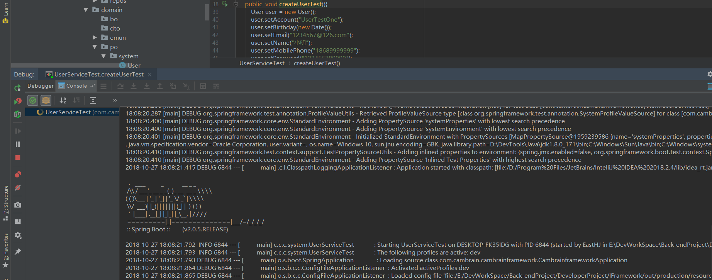

# SpringBoot框架搭建学习

### 第一章 创建项目


  
    通过SpringBoot 创建项目
    
  1 . 项目简要说明：
  
  >  - jdk版本: jdk-8
  >  - 项目构建方式：Gradle
  >  - Spring Boot 版本： 2.0.5.RELEASE
  
   

   如下图所示：
   
   
   ----
   
   2 . 选择项目构建方式
   
   如下图2所示：
   
   
   ----
   
   3 . 选择项目依赖
   
   根据可能会用到的功能选择了一下相关依赖：
   
   > Core  : DevTools 、 Lombok <br>
   > Web   : Web 、 REST Docs <br>
   > SQL   : JPA 、 MySQL 、 MyBatis <br> 
   > NoSQL : Redis <br>
   > Integration : RabbitMQ <br>
   > I/O  : Quartz Scheduler
   
  
  
  ----
  
   
   4 . 选择完成之后next 下一步然后Finsh 完成
   
   
   项目完成之后的项目结构图如下所示：
   
 
 
 ----
 
 
 
### 第二章 项目集成Druid作为数据源并添加数据源监控

   #### **添加依赖**
 
 
 从Maven 仓库中查询 Druid 相应依赖配置访问 [Druid Maven仓库](<a href="http://mvnrepository.com/artifact/com.alibaba" target="_blank">Durid Maven仓库</a>)
 
 
    选择1.1.10，点击进入后复制Gradle内容然后粘贴到build.gradle内即可 
    可以单独添加druid依赖或者使用druid-starter
    
 如下图所示： 查询Druid 
 
 
 ----

 选择Druid Spring Boot Starter 
 
 
 
 ----
 复制Gradle 相关配置
 
 

----
 拷贝到项目的Gradle配置文件中，用Gradle将相应的依赖导入项目中
 
 
 
 ----
  刷新等待依赖导入完成。
 
 ----
 #### **配置文件中配置Druid**
 
 我们已经将druid添加到我们的项目中，那么接下来我们需要修改application.yml配置文件，添加druid的支持
 
 ```yaml
 
spring:
  datasource:
    #指定数据源类型
    type: com.alibaba.druid.pool.DruidDataSource
    #数据源相关配置
    url: jdbc:mysql://localhost:3306/cambrainc?createDatabaseIfNotExist=true&autoReconnect=true&characterEncoding=utf8&useSSL=false&&zeroDateTimeBehavior=convertToNull
    username: root
    password: root
    driver-class-name: com.mysql.jdbc.Driver
    #最大活跃数
    maxActive: 20
    #初始化数量
    initialSize: 1
    #最大连接等待超时时间
    maxWait: 60000
    #打开PSCache，并且指定每个连接PSCache的大小
    poolPreparedStatements: true
    maxPoolPreparedStatementPerConnectionSize: 20
    #通过connectionProperties属性来打开mergeSql功能；慢SQL记录
    #connectionProperties: druid.stat.mergeSql=true;druid.stat.slowSqlMillis=5000
    minIdle: 1
    timeBetweenEvictionRunsMillis: 60000
    minEvictableIdleTimeMillis: 300000
    validationQuery: select 1 from dual
    testWhileIdle: true
    testOnBorrow: false
    testOnReturn: false
    #配置监控统计拦截的filters，去掉后监控界面sql将无法统计,'wall'用于防火墙
    filters: stat, wall, log4j
```

 #### **运行项目**
 
 配置完成之后我们启动项目，当看到如下启动日志时，则说明druid已经配置成功。
 
 
 
 我们已经完成了SpringBoot整合Druid连接池的部分，那么我们接下来开启Druid的监控功能。
 
 #### **配置Druid监控**
 
   开启监控功能，可以在应用运行的过程中，通过监控提供的多维度数据来分析使用数据库的运行情况，从而可以调整程序设计，以便于优化数据库的访问性能。
 开启Druid监控功能需要添加Druid相应的配置类。
 
 如下图所示：
 
 
 ----
 
 添加完成相应的配置之后，我们需要重启项目，如果有错误，自己可以搜索尝试解决。在配置中，我们通过在配置类上添加@Configuration注解来将相应的配置应用到全局
 。
 
 项目运行成功后，我们要访问Druid的监控界面，访问地址：127.0.0.1:8630/druid/login.html，效果如下图所示：
 
 
 ----
 
 用户名和密码就是我么在配置类中填写的用户名和密码：
 
 
 ----
 
 登陆后的监控页面如下图：
 
 ----
 
 可以看到大致包含了如下几个模块：数据源、SQL监控、SQL防火墙、Web应用、URI监控、Session监控、JSONAPI等。
 
 数据源
 可以看到项目中管理的所有数据源配置的详细情况，除了密码没有显示外其他都在。
 
 SQL监控
 可以查看所有的执行sql语句
 
 SQL防火墙
 druid提供了黑白名单的访问，可以清楚的看到sql防护情况。
 
 Web应用
 可以看到目前运行的web程序的详细信息。
 
 URI监控
 可以监控到所有的请求路径的请求次数、请求时间等其他参数。
 
 Session监控
 可以看到当前的session状况，创建时间、最后活跃时间、请求次数、请求时间等详细参数。
 
 JSONAPI
 通过api的形式访问Druid的监控接口，api接口返回Json形式数据。
 
 至此，我们项目关于Druid 的集成就已经完成了。
 
 ### **第三章 项目集成 Spring Data JPA 执行基本的CURD**
 
   SpringBoot框架提供了许多有用的组件，我们需要时直接添加相应的依赖使用就可以了。接下来我们先测试在项目中使用Sping Data JPA 完成基本的CURD。
 我们在创建项目时，已经添加了JPA 相关的依赖，我们的数据库使用MySQL，如果使用其他的数据库可以根据需要引入不同的依赖支持。
   
   接下来我们进行JPA 集成测试。
   
   ##### **本章目标**
   
   学习并且使用SpringBoot访问MySQL数据库，并且结合SpringDataJPA完成CRUD（Create,Read,Update,Delete）简单操作。
   
   
   > 1 . 在项目中添加JPA 相关配置
  
  ```yaml
  jpa:
      database: mysql
      show-sql: true
      hibernate:
        ddl-auto: update
``` 

 > 2 . 数据库中创建测试表
 
 ```sql
-- ----------------------------
-- Table structure for sys_user
-- ----------------------------
DROP TABLE IF EXISTS `sys_user`;
CREATE TABLE `sys_user`  (
  `id` varchar(64) CHARACTER SET utf8 COLLATE utf8_general_ci NOT NULL COMMENT '主键id',
  `avatar` varchar(255) CHARACTER SET utf8 COLLATE utf8_general_ci NULL DEFAULT NULL COMMENT '头像',
  `account` varchar(45) CHARACTER SET utf8 COLLATE utf8_general_ci NOT NULL COMMENT '账号',
  `password` varchar(45) CHARACTER SET utf8 COLLATE utf8_general_ci NOT NULL COMMENT '密码',
  `salt` varchar(45) CHARACTER SET utf8 COLLATE utf8_general_ci NULL DEFAULT NULL COMMENT 'md5密码盐',
  `name` varchar(45) CHARACTER SET utf8 COLLATE utf8_general_ci NULL DEFAULT NULL COMMENT '名字',
  `birthday` date NULL DEFAULT NULL COMMENT '生日',
  `sex_id` varchar(11) CHARACTER SET utf8 COLLATE utf8_general_ci NULL DEFAULT NULL COMMENT '性别（1：男 2：女）',
  `email` varchar(45) CHARACTER SET utf8 COLLATE utf8_general_ci NULL DEFAULT NULL COMMENT '电子邮件',
  `mobile_phone` varchar(45) CHARACTER SET utf8 COLLATE utf8_general_ci NULL DEFAULT NULL COMMENT '电话',
  `role_id` varchar(255) CHARACTER SET utf8 COLLATE utf8_general_ci NULL DEFAULT NULL COMMENT '角色id',
  `dept_id` varchar(11) CHARACTER SET utf8 COLLATE utf8_general_ci NULL DEFAULT NULL COMMENT '部门id',
  `status` int(11) NULL DEFAULT NULL COMMENT '状态(1：启用  2：冻结  3：删除）',
  `create_time` datetime(0) NULL DEFAULT NULL COMMENT '创建时间',
  `cancel_name` varchar(20) CHARACTER SET utf8 COLLATE utf8_general_ci NULL DEFAULT NULL COMMENT '作废人',
  `cancel_time` datetime(0) NULL DEFAULT CURRENT_TIMESTAMP ON UPDATE CURRENT_TIMESTAMP(0) COMMENT '作废时间',
  `create_name` varchar(20) CHARACTER SET utf8 COLLATE utf8_general_ci NULL DEFAULT NULL COMMENT '创建人',
  `tag` int(4) NULL DEFAULT 999 COMMENT '标签，-1为删除',
  `update_name` varchar(20) CHARACTER SET utf8 COLLATE utf8_general_ci NULL DEFAULT NULL COMMENT '更新人',
  `update_time` datetime(0) NULL DEFAULT CURRENT_TIMESTAMP ON UPDATE CURRENT_TIMESTAMP(0) COMMENT '更新时间',
  PRIMARY KEY (`id`) USING BTREE
) ENGINE = InnoDB CHARACTER SET = utf8 COLLATE = utf8_general_ci COMMENT = '管理员表' ROW_FORMAT = Dynamic;

SET FOREIGN_KEY_CHECKS = 1;

```


> 3 . 创建实体

我们根据数据库中的字段对应创建一个User来作为对应操作
```java
public class User extends BaseEntity {
/**
     * 头像
     */
    @Column(name = "AVATAR", columnDefinition = "VARCHAR(16000) COMMENT '头像'")
    private String avatar;
    /**
     * 账号
     */
    @Column(name = "ACCOUNT", columnDefinition = "VARCHAR(64) COMMENT '账号'")
    private String account;
    /**
     * 密码
     */
    @Column(name = "PASSWORD", columnDefinition = "VARCHAR(64) COMMENT '密码'")
    private String password;
    /**
     * md5密码校验
     */
    @Column(name = "MD5_SALT", columnDefinition = "VARCHAR(64) COMMENT 'MD5加密校验盐'")
    private String salt;
    /**
     * 名字
     */
    @Column(name = "NAME", columnDefinition = "VARCHAR(64) COMMENT '用户名称'")
    private String name;
    /**
     * 生日
     */
    @Column(name = "BIRTHDAY", columnDefinition = "DATE  COMMENT '生日'")
    @Temporal(value = TemporalType.TIMESTAMP)
    @JsonFormat(pattern = "yyyy-MM-dd", locale = "zh", timezone = "GMT+8")
    private Date birthday;
    /**
     * 性别（1：男 2：女）
     */
    @Column(name = "SEX_ID", columnDefinition = "VARCHAR(64) COMMENT '性别ID'")
    private String sexId;
    /**
     * 电子邮件
     */
    @Column(name = "EMAIL", columnDefinition = "VARCHAR(64) COMMENT '邮箱'")
    private String email;
    /**
     * 电话
     */
    @Column(name = "MOBILE_PHONE", columnDefinition = "VARCHAR(64) COMMENT '手机'")
    private String mobilePhone;
    /**
     * 角色id
     */
    @Column(name = "ROLE_ID", columnDefinition = "VARCHAR(64) COMMENT '角色ID'")
    private String roleId;
    /**
     * 部门id
     */
    @Column(name = "DEPT_ID", columnDefinition = "VARCHAR(64) COMMENT '部门ID'")
    private String deptId;
    /**
     * 状态(10：启用  20：冻结  30：删除）
     */
    @Column(name = "STATUS", columnDefinition = "INT COMMENT '状态'")
    private Integer status;
}
```
编写实体类如图


>4.编写数据操作类
如下图：

```java
package com.cambrain.cambrainframework.core.dao.repos.system;

import com.cambrain.cambrainframework.core.dao.repos.BaseRepo;
import com.cambrain.cambrainframework.core.domain.po.system.User;
import org.springframework.stereotype.Repository;

/**
 * @ProjectName: [IFramework]
 * @Package: [com.cambrain.cambrainframework.core.dao.repos.system]
 * @ClassName: [UserRepo]
 * @Description: 用户数据操作仓库
 * @Author: [EastHJ]
 * @CreateDate: [2018-10-26 15:23]
 * @UpdateUser: [EastHJ]
 * @UpdateDate: [2018-10-26 15:23]
 * @UpdateRemark: [说明本次修改内容]
 * @Version: [v1.0]
 */
@Repository
public interface UserRepo extends BaseRepo<User,String> {
}

```
>5.编写业务类<br>
业务类接口

```java
package com.cambrain.cambrainframework.core.service.system;

import com.cambrain.cambrainframework.core.domain.po.system.User;
import com.cambrain.cambrainframework.core.service.BaseService;
import org.springframework.stereotype.Service;

/**
 * @ProjectName: [IFramework]
 * @Package: [com.cambrain.cambrainframework.core.service.system]
 * @ClassName: [UserService]
 * @Description:  用户业务接口类
 * @Author: [EastHJ]
 * @CreateDate: [2018-10-26 15:44]
 * @UpdateUser: [EastHJ]
 * @UpdateDate: [2018-10-26 15:44]
 * @UpdateRemark: [说明本次修改内容]
 * @Version: [v1.0]
 */

public interface UserService extends BaseService<User> {
}

```
业务实现类
```java
package com.cambrain.cambrainframework.core.service.system.impl;

import com.cambrain.cambrainframework.core.dao.repos.system.UserRepo;
import com.cambrain.cambrainframework.core.domain.emun.EntityEnum;
import com.cambrain.cambrainframework.core.domain.po.system.User;
import com.cambrain.cambrainframework.core.service.system.UserService;
import org.springframework.beans.factory.annotation.Autowired;
import org.springframework.stereotype.Service;

import java.util.List;

/**
 * @ProjectName: [IFramework]
 * @Package: [com.cambrain.cambrainframework.core.service.system.impl]
 * @ClassName: [UserServiceImpl]
 * @Description:  用户业务逻辑实现类
 * @Author: [EastHJ]
 * @CreateDate: [2018-10-26 15:46]
 * @UpdateUser: [EastHJ]
 * @UpdateDate: [2018-10-26 15:46]
 * @UpdateRemark: [说明本次修改内容]
 * @Version: [v1.0]
 */
@Service
public class UserServiceImpl implements UserService {

    @Autowired
    private UserRepo userRepo;

    @Override
    public List<User> list(User e) {
        List<User> users =   userRepo.findAll();
        return  users;
    }

    @Override
    public User cancle(String id) {
      User user =   userRepo.findById(id).get();
        if(null != user)
        {
            user.setTag(EntityEnum.TAG_CANCEL.getCode());
            userRepo.save(user);
        }
        return user;
    }

    @Override
    public User delete(String id) {
        User user =   userRepo.findById(id).get();
        if(null != user)
        {
            user.setStatus(EntityEnum.STATUS_DELETE.getCode());
            userRepo.save(user);
        }
        return user;
    }


    @Override
    public User modify(User entity) {

        userRepo.save(entity);
        User user = userRepo.findById(entity.getId()).get();

        return user;
    }


    @Override
    public User findById(String id) {
        User user = userRepo.findById(id).get();
        return user;
    }
}

```
>6.编写测试类
```java
package com.cambrain.cambrainframework.system;

import com.cambrain.cambrainframework.core.domain.po.system.User;
import com.cambrain.cambrainframework.core.service.system.UserService;
import org.junit.Test;
import org.junit.runner.RunWith;
import org.springframework.beans.factory.annotation.Autowired;
import org.springframework.boot.test.context.SpringBootTest;
import org.springframework.test.annotation.Rollback;
import org.springframework.test.context.junit4.SpringRunner;

import javax.transaction.Transactional;
import java.util.Date;
import java.util.List;

/**
 * @ProjectName: [IFramework]
 * @Package: [com.cambrain.cambrainframework.system]
 * @ClassName: [UserServiceTest]
 * @Description:  TODO  填写功能描述
 * @Author: [EastHJ]
 * @CreateDate: [2018-10-26 21:59]
 * @UpdateUser: [EastHJ]
 * @UpdateDate: [2018-10-26 21:59]
 * @UpdateRemark: [说明本次修改内容]
 * @Version: [v1.0]
 */
@RunWith(SpringRunner.class)
@SpringBootTest
public class UserServiceTest {

    @Autowired
    private UserService userService;

    @Test
    @Transactional
    @Rollback
    public  void createUserTest(){
        User user = new User();
        user.setAccount("UserTestOne");
        user.setBirthday(new Date());
        user.setEmail("1234567@126.com");
        user.setName("小明");
        user.setMobilePhone("18689999999");
        user.setPassword("123456789999");
        user.setSalt("145869656");
        userService.modify(user);
        System.out.println(user.toString());
    }

   @Test
    public void findUserTest(){
        List<User> userList = userService.list(null);
        System.out.println(userList);
        userList.forEach(u->{
            System.out.println(u.toString());
        });
    }

}

```


>7.运行测试类
当业务运行的各个类编写完成之后，通过单元测试运行来测试业务流程是否可以运行，当测试成功后，则说明业务流程可以正常处理。


当单元测试完成后，此时使用JPA进行数据访问的功能就添加成功了。